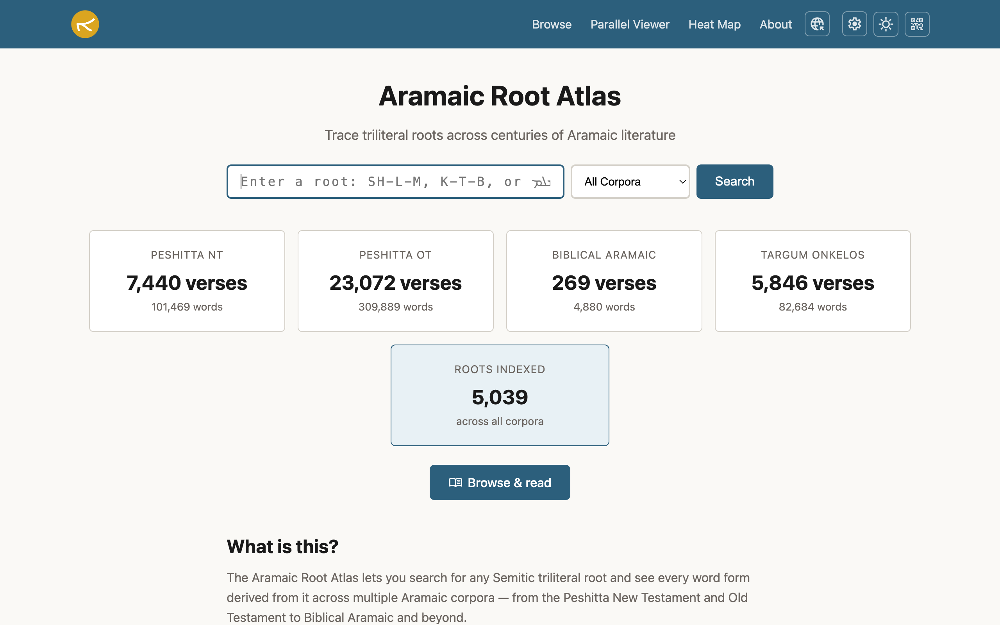
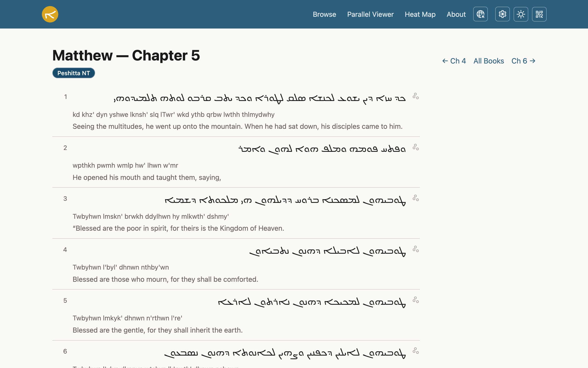
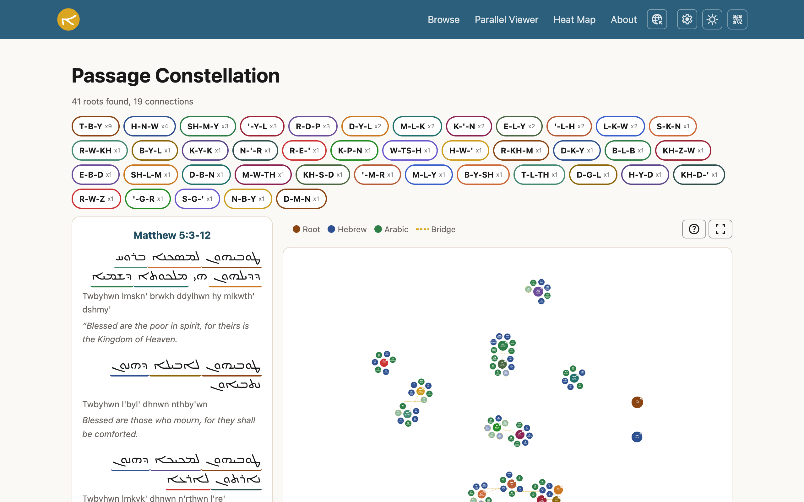
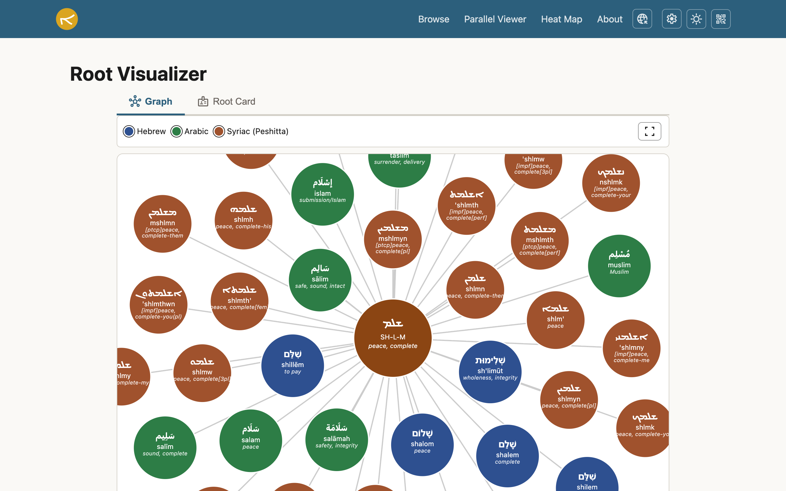
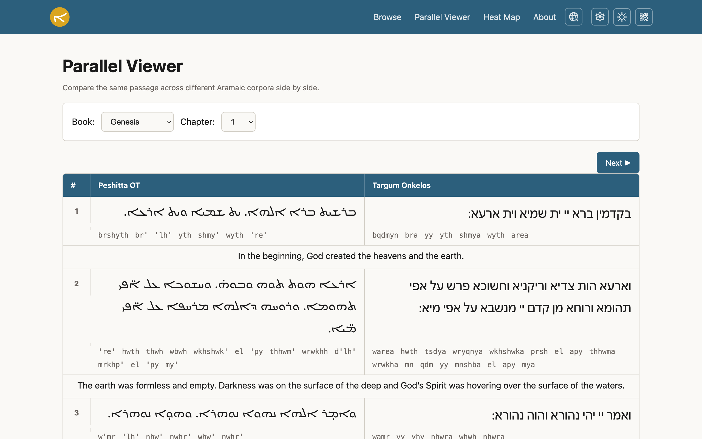
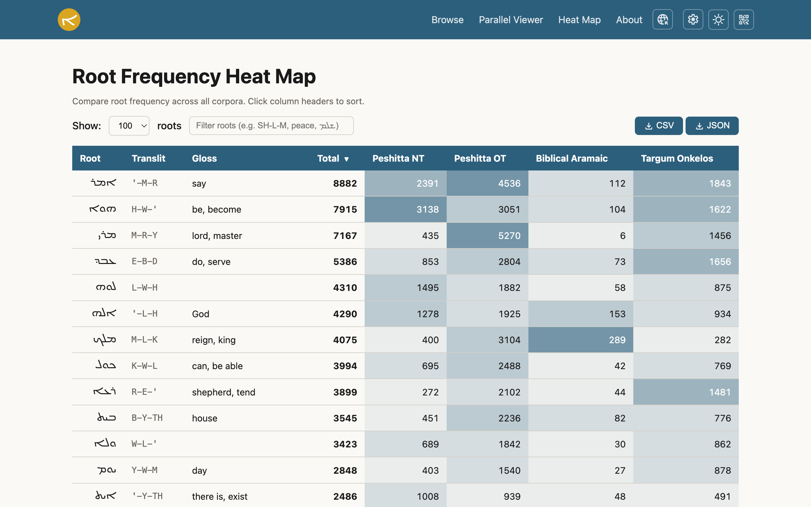

# Aramaic Root Atlas

**[Live App](https://aramaic-root-atlas.onrender.com)** · A cross-corpus triliteral root explorer spanning ~1,500 years of Aramaic literary history.

**36,627 verses** · **498,922 words** · **5,039 roots** · **1,127 cognate families** · **4 corpora**

---

## Features

- **Root search with autocomplete** -- look up any triliteral root in Latin, Syriac, Hebrew, or Arabic script
- **Root family visualizer** -- D3.js force-directed graph showing word forms, cognates, sister roots, and semantic bridges
- **Passage constellation** -- visualize all roots and their relationships within a selected passage
- **Parallel viewer** -- side-by-side comparison of Peshitta OT, Targum Onkelos, and Biblical Aramaic
- **Root frequency heat map** -- cross-corpus root distribution with filter, sort, and CSV/JSON export
- **KWIC search** -- keyword-in-context results with inline expansion and verse modal
- **Proximity search** -- find co-occurring roots at verse or chapter scope
- **Quadrilingual UI** -- full interface in English, Spanish, Hebrew, and Arabic with RTL support
- **Four translation tracks** -- WEB (EN), Reina-Valera 1909 (ES), WLC (HE), Van Dyck (AR)
- **Three Syriac font styles** -- Estrangela, Eastern (Madnhaya), Western (Serto)
- **Dark mode** and QR sharing

## Screenshots



| Verse Reader | Constellation | Root Visualizer |
|:---:|:---:|:---:|
|  |  |  |

| Parallel Viewer | Heat Map |
|:---:|:---:|
|  |  |

## Quick Start

**Prerequisites:** Python 3.8+, Flask

```bash
# Clone the repository
git clone https://github.com/Jossifresben/aramaic-root-atlas.git
cd aramaic-root-atlas

# Install dependencies
pip install -r requirements.txt

# Run the app
python3 app.py
```

The app starts on **http://localhost:5001**.

## Corpora

| Corpus | Verses | Words | Script | Source | License |
|--------|-------:|------:|--------|--------|---------|
| Peshitta NT | 7,440 | 101,469 | Syriac | BFBS Peshitta | Public domain |
| Peshitta OT | 23,072 | 309,889 | Syriac | ETCBC / Leiden Peshitta Institute | CC-BY-NC |
| Biblical Aramaic | 269 | 4,880 | Hebrew square | Sefaria (Westminster Leningrad Codex) | CC-BY-SA |
| Targum Onkelos | 5,846 | 82,684 | Syriac | Sefaria | CC-BY-SA |
| **Total** | **36,627** | **498,922** | | | |

Cross-script root normalization ensures that Syriac and Hebrew square script resolve to the same root key.

## API Reference

The Atlas exposes a full JSON API for programmatic access. All endpoints support optional `lang` (en/es/he/ar), `corpus` filter, and `script` parameters.

| Endpoint | Description |
|----------|-------------|
| `GET /api/stats` | Corpus statistics (verses, words, roots per corpus) |
| `GET /api/roots?q=SH-L-M` | Root lookup with cognates, glosses, cross-corpus attestation |
| `GET /api/root-family?root=SH-L-M` | Root family: word forms, cognates, sister roots, key verse |
| `GET /api/search?q=peace&lang=en` | Full-text search across translation tracks |
| `GET /api/suggest?prefix=SH` | Autocomplete suggestions for root input |
| `GET /api/books?corpus=peshitta_nt` | Book list with chapter counts, filterable by corpus |
| `GET /api/chapter/<book>/<ch>` | Chapter text with transliteration and translation |
| `GET /api/chapter/<book>/<ch>?parallel=true` | All corpus versions of each verse (for parallel viewer) |
| `GET /api/verse?ref=Psalms+1:1` | Single verse with word-level root analysis |
| `GET /api/proximity-search?root1=SH-L-M&root2=K-TH-B` | Co-occurring roots at verse/chapter scope |
| `GET /api/passage-constellation` | D3 constellation graph data for a passage range |
| `GET /api/parallel?ref=Genesis+1:1` | Parallel texts for a verse across all corpora |
| `GET /api/heatmap?limit=100&sort=total` | Root frequency heat map across corpora |

**Root input formats:** Dash-separated Latin (`SH-L-M`), Syriac Unicode (`ܫܠܡ`), Hebrew (`שלם`), or Arabic (`سلم`). The API auto-detects and normalizes.

> **Full API documentation** with parameters, response schemas, and examples: **[docs/API.md](docs/API.md)**

## Architecture

```
aramaic-root-atlas/
  aramaic_core/          # Shared linguistic engine (zero Flask dependencies)
    characters.py        #   Syriac/Hebrew/Arabic character maps, transliteration
    affixes.py           #   Syriac prefix/suffix stripping
    affixes_hebrew.py    #   Biblical Aramaic affix stripping (Hebrew script)
    corpus.py            #   AramaicCorpus: multi-corpus CSV loader
    extractor.py         #   RootExtractor: triliteral root extraction + scoring
    cognates.py          #   CognateLookup: Hebrew & Arabic cognate lookup
    glosser.py           #   WordGlosser: compositional word-level glossing
  app.py                 # Flask application (port 5001)
  templates/             # Jinja2 templates
  static/style.css       # CSS with corpus-coded color variables
  data/
    corpora/             # CSV corpus files (peshitta_nt, peshitta_ot, biblical_aramaic, targum_onkelos)
    roots/               # cognates.json, known_roots.json, stopwords.json
    translations/        # translations_{en,es,he,ar}.json
  scripts/               # Data pipeline scripts (fetch, generate)
  docs/                  # PRD, API docs, source attribution
```

## Data Sources

- **Peshitta NT** -- BFBS Peshitta (public domain)
- **Peshitta OT** -- ETCBC/peshitta, Leiden Peshitta Institute (CC-BY-NC)
- **Biblical Aramaic** -- Westminster Leningrad Codex via Sefaria API (CC-BY-SA)
- **Targum Onkelos** -- Sefaria API (CC-BY-SA)
- **Translations** -- WEB (EN), Reina-Valera 1909 (ES), WLC (HE), Van Dyck (AR) via [bible.helloao.org](https://bible.helloao.org)
- **Cognates** -- 1,127 entries with Hebrew/Arabic cognates, generated and curated with the Claude API

See [docs/SOURCES.md](docs/SOURCES.md) for full attribution details.

## Related

- [Peshitta Root Finder](https://peshitta.onrender.com) -- the predecessor project focused on the Peshitta NT

## Author

Created by [Jossi Fresco](https://jossifresco.com)

## License

Apache License 2.0. See [LICENSE](LICENSE) for details.
