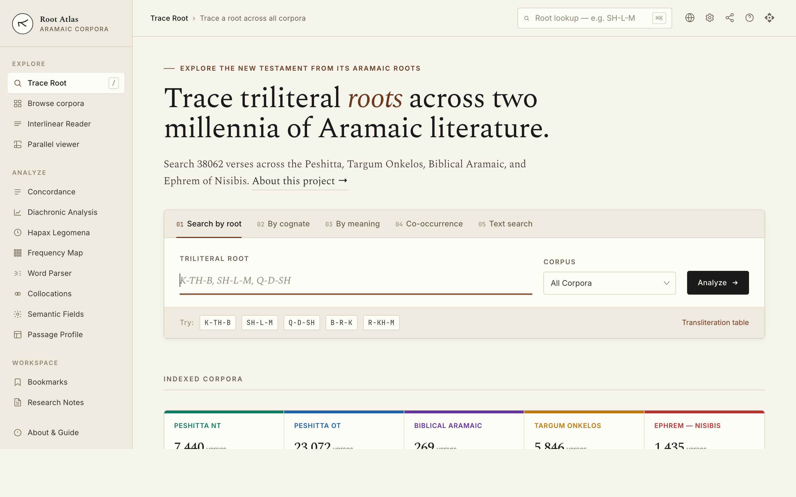

# Aramaic Root Atlas

**[Live App](https://aramaic-root-atlas.onrender.com)** &nbsp; [](https://doi.org/10.5281/zenodo.19358625)

The Aramaic Root Atlas is an open-access tool for exploring triliteral roots across the major corpora of Aramaic literature. It spans approximately 1,500 years of literary history — from the Biblical Aramaic passages of Daniel and Ezra (~6th–2nd c. BCE) through Targum Onkelos (~1st–3rd c. CE) to the Peshitta Old and New Testaments (~2nd–5th c. CE) and the Hymns of Ephrem the Syrian (~4th c. CE) — indexing 5,249 roots across 38,062 verses and 528,399 words.

The tool is designed for scholars, students, and linguists who want to study Aramaic vocabulary across time and tradition: tracing how a root is used in different dialects and genres, finding rare or unique attestations, comparing parallel passages, or analyzing verb stem distributions. Every word form in the corpus is linked to its extracted root, gloss, confidence score, and verb stem, accessible directly from the verse reader.

**38,062 verses** · **528,399 words** · **5,249 roots** · **1,584 cognate root entries** · **5 corpora**

---

## Features

### Research Tools
- **Verb Stem (Binyan) Analysis** -- classifies every word form into Peal/Ethpeel/Pael/Ethpaal/Aphel/Shafel/Ettaphal; stem badge in word popover; stem distribution chart + paradigm table in root card; `/api/paradigm` endpoint
- **Hapax Legomena Finder** -- `/hapax` page surfaces roots and forms with 1–5 occurrences across any corpus; frequency slider, corpus filter, scope toggle, CSV/JSON export
- **KWIC Concordance with Export** -- `/concordance` page shows all attestations in traditional left-context | keyword | right-context layout; group by form or stem; export as CSV, JSON, plain text, or TEI XML
- **Diachronic Root Analysis** -- `/diachronic` page compares root usage across five corpora in chronological order (Biblical Aramaic → Targum Onkelos → Peshitta NT → Peshitta OT → Ephrem Nisibis) as normalized frequency; Shifts View ranks roots by frequency change magnitude with color-coded corpus dots
- **Collocations** -- `/collocations` page computes Pointwise Mutual Information (PMI) between roots co-occurring in the same verse or chapter; filter by corpus and minimum co-occurrence count to surface statistically significant lexical associations; CSV/JSON export
- **Semantic Fields** -- `/semantic-fields` page organizes all roots into 15 semantic domains (legal/covenant, cultic, kinship, war, knowledge, etc.) via AI classification; each domain lists roots sorted by frequency with corpus badges and links to the visualizer
- **Researcher Annotations** -- `/annotations` page for inline notes on verses and roots, stored in localStorage; tag-based filtering, export as JSON/CSV/Markdown; inline note icons in the verse reader and root card
- **Cite This** -- one-click citation export in five academic formats (BibTeX, Chicago, MLA, APA, SBL) plus Zotero RDF, accessible from any tool page; copy-to-clipboard and DOI-linked
- **BibTeX & Zotero Export** -- generate academic citations from bookmarks in BibTeX (`.bib`) or Zotero RDF (`.rdf`) formats directly from the bookmarks page
- **Word Parser** -- `/parse` page provides full morphological breakdown of any Syriac word: prefixes, root, suffixes shown as colour-coded morpheme boxes; stem badge; cognates with Hebrew/Arabic pills; corpus attestation counts; accepts Syriac Unicode or Latin transliteration input (`shlm`, `sh-l-m`)
- **Passage Lexical Profile** -- `/passage-profile` page analyses any passage range (book + chapter span): word count, unique roots, lexical density, hapax count, stem distribution chart, root rarity breakdown, top-15 roots with corpus pills, verse-by-verse density sparkline

### Exploration & Reading
- **Word-level root display** -- click any Syriac word in the reader to see its extracted root, gloss, confidence score, verb stem, and link to the root visualizer
- **Root confidence scoring** -- three-tier system (High >= 0.8, Medium 0.5--0.8, Low < 0.5) with methodological notes on the About page
- **Chapter root summary** -- toggle panel showing all roots in a chapter sorted by frequency, with CSV/JSON export
- **5-tab search system** -- search by root (with autocomplete), by cognate (Hebrew/Arabic/transliteration reverse lookup), by meaning (English/Spanish reverse search), co-occurrence (proximity search for two roots), or full-text across translations
- **Root family visualizer** -- D3.js force-directed graph showing word forms, cognates, sister roots, semantic bridges, stem distribution, paradigm table, and diachronic usage bars
- **Passage constellation** -- visualize all roots and their relationships within a selected passage
- **Parallel viewer** -- side-by-side comparison of Peshitta OT, Targum Onkelos, and Biblical Aramaic
- **Root frequency heat map** -- cross-corpus root distribution with filter, sort, and CSV/JSON export
- **Bookmarks** -- save verses and roots with tags, export as CSV/JSON, copy formatted citations

### Interface
- **Sidebar navigation** -- persistent left rail groups every tool by purpose (Explore, Analyze, Workspace), keeping the active page highlighted; sticky topbar with breadcrumb, ⌘K quick-search across all roots, and shortcut menus for language, settings, share, tour, and Swagger
- **Quadrilingual UI** -- full interface in English, Spanish, Hebrew, and Arabic with RTL support
- **Greek cognates** -- 405 Greek NT parallels linked to Aramaic roots in the visualizer (e.g., SH-L-M -> eirene "peace")
- **Five translation tracks** -- WEB (EN), Reina-Valera 1909 (ES), WLC (HE), Van Dyck (AR), SBLGNT (Greek)
- **Three Syriac font styles** -- Estrangela, Eastern (Madnhaya), Western (Serto)
- **Dark mode** and QR sharing
- **Swagger API docs** -- interactive OpenAPI 3.0 reference at [`/api-docs`](https://aramaic-root-atlas.onrender.com/api-docs) covering all 28 REST endpoints with parameters, response schemas, examples, and try-it-out
- **Guided Tour** -- 12-step interactive walkthrough of all features, available in all four UI languages; accessible via the ? button in the navbar or the Watch Video / Tour button on the Guide page
- **Watch Video** -- in-app video walkthrough on the Guide page, plays in a viewport-wide modal with fullscreen support

## Video Demo

A walkthrough video is being re-recorded against the v3.0 sidebar UI; the prior recording showed the pre-redesign interface and was withdrawn. In the meantime, see the live app at **[aramaic-root-atlas.onrender.com](https://aramaic-root-atlas.onrender.com)** or take the interactive 12-step **Guided Tour** (click the ? icon in the topbar).

## Screenshot



> See the full UI live at **[aramaic-root-atlas.onrender.com](https://aramaic-root-atlas.onrender.com)** or watch the in-app video walkthrough on the [Guide page](https://aramaic-root-atlas.onrender.com/about).

## Quick Start

**Prerequisites:** Python 3.8+, Flask

```bash
# Clone the repository
git clone https://github.com/Jossifresben/aramaic-root-atlas.git
cd aramaic-root-atlas

# Install dependencies
pip install -r requirements.txt

# Run the app
python3 app.py
```

The app starts on **http://localhost:5001**.

## Corpora

| Corpus | Verses | Words | Script | Source | License |
|--------|-------:|------:|--------|--------|---------|
| Peshitta NT | 7,440 | 101,469 | Syriac | BFBS Peshitta | Public domain |
| Peshitta OT | 23,072 | 309,889 | Syriac | ETCBC / Leiden Peshitta Institute | CC-BY-NC |
| Biblical Aramaic | 269 | 4,880 | Hebrew square | Sefaria (Westminster Leningrad Codex) | CC-BY-SA |
| Targum Onkelos | 5,846 | 82,684 | Syriac | Sefaria | CC-BY-SA |
| Ephrem Nisibis | 1,435 | 29,477 | Syriac | Digital Syriac Corpus (srophe) | CC-BY |
| **Total** | **38,062** | **528,399** | | | |

Cross-script root normalization ensures that Syriac and Hebrew square script resolve to the same root key.

## API Reference

The Atlas exposes a full JSON API for programmatic access. All endpoints support optional `lang` (en/es/he/ar), `corpus` filter, and `script` parameters.

| Endpoint | Description |
|----------|-------------|
| `GET /api/stats` | Corpus statistics (verses, words, roots per corpus) |
| `GET /api/roots?q=SH-L-M` | Root lookup with cognates, glosses, cross-corpus attestation |
| `GET /api/root-family?root=SH-L-M` | Root family: word forms, cognates, sister roots, key verse |
| `GET /api/search?q=peace&lang=en` | Full-text search across translation tracks |
| `GET /api/suggest?prefix=SH` | Autocomplete suggestions for root input |
| `GET /api/books?corpus=peshitta_nt` | Book list with chapter counts, filterable by corpus |
| `GET /api/chapter/<book>/<ch>` | Chapter text with transliteration and translation |
| `GET /api/chapter/<book>/<ch>?parallel=true` | All corpus versions of each verse (for parallel viewer) |
| `GET /api/verse?ref=Psalms+1:1` | Single verse with word-level root analysis |
| `GET /api/chapter-roots?book=Matthew&chapter=5` | All roots in a chapter sorted by frequency |
| `GET /api/proximity-search?root1=SH-L-M&root2=K-TH-B` | Co-occurring roots at verse/chapter scope |
| `GET /api/passage-constellation` | D3 constellation graph data for a passage range |
| `GET /api/parallel?ref=Genesis+1:1` | Parallel texts for a verse across all corpora |
| `GET /api/cognate-lookup?word=shalom` | Reverse lookup roots by Hebrew/Arabic/transliterated cognate |
| `GET /api/reverse-search?q=peace&lang=en` | Search roots by English/Spanish meaning (ranked by relevance) |
| `GET /api/heatmap?limit=100&sort=total` | Root frequency heat map across corpora |
| `GET /api/paradigm?root=K-T-B` | Word forms grouped by verb stem (Peal/Ethpeel/Pael/…) |
| `GET /api/hapax?max_freq=1&corpus=&scope=root` | Roots or forms with ≤N total occurrences |
| `GET /api/concordance?root=SH-L-M&context_words=5` | KWIC data with left/keyword/right context windows |
| `GET /api/concordance/export?root=SH-L-M&format=tei` | Server-side TEI XML concordance export |
| `GET /api/diachronic/root?root=K-T-B` | Normalized frequency per corpus in chronological order |
| `GET /api/diachronic/shifts?direction=emerging` | Roots ranked by cross-corpus frequency shift magnitude |
| `GET /api/diachronic/unique?corpus=biblical_aramaic` | Roots attested in only one corpus |
| `GET /api/collocations?root=SH-L-M&scope=verse` | PMI-scored co-occurring roots at verse or chapter scope |
| `GET /api/semantic-fields` | All 15 semantic domains with root counts |
| `GET /api/semantic-fields/<field>` | Roots in a domain sorted by frequency with corpus counts |
| `GET /api/word-parse?word=ܫܠܡ` | Full morphological parse: prefixes, root, suffixes, stem, gloss, cognates, corpus attestation |
| `GET /api/passage-profile?book=Matthew&ch_start=5&ch_end=7` | Lexical profile for a passage: word count, unique roots, density, stem distribution, top roots, hapax count |

> **API versioning:** every endpoint above is also reachable under `/api/v1/X` (e.g. `GET /api/v1/roots?q=SH-L-M`). New integrations should use `/api/v1/`. The legacy `/api/X` URLs remain for backwards compatibility but have no stability contract — see [docs/API-STABILITY.md](docs/API-STABILITY.md). All responses include `X-RateLimit-*` headers; current limits are 600 req/min and 60 req/sec per IP.

**Root input formats:** Dash-separated Latin (`SH-L-M`), Syriac Unicode (`ܫܠܡ`), Hebrew (`שלם`), or Arabic (`سلم`). The API auto-detects and normalizes.

> **Interactive API documentation** (Swagger UI) with try-it-out, parameter examples, and response schemas: **[/api-docs](https://aramaic-root-atlas.onrender.com/api-docs)**

## Architecture

```
aramaic-root-atlas/
  aramaic_core/          # Shared linguistic engine (zero Flask dependencies)
    characters.py        #   Syriac/Hebrew/Arabic character maps, transliteration
    affixes.py           #   Syriac prefix/suffix stripping
    affixes_hebrew.py    #   Biblical Aramaic affix stripping (Hebrew script)
    corpus.py            #   AramaicCorpus: multi-corpus CSV loader
    extractor.py         #   RootExtractor: triliteral root extraction + scoring
    cognates.py          #   CognateLookup: Hebrew & Arabic cognate lookup
    glosser.py           #   WordGlosser: compositional word-level glossing
    sedra_lookup.py      #   SEDRA lexicon cache lookup for enhanced root confidence
  app.py                 # Flask application (port 5001)
  templates/             # Jinja2 templates (read, browse, visualize, hapax, concordance, diachronic, parse, passage_profile, …)
  static/style.css       # CSS with corpus-coded color variables and stem-badge palette
  static/autocomplete.js # Shared root autocomplete widget
  data/
    corpora/             # CSV corpus files (peshitta_nt, peshitta_ot, biblical_aramaic, targum_onkelos, ephrem_nisibis)
    roots/               # cognates.json, known_roots.json, stopwords.json
    translations/        # translations_{en,es,he,ar}.json
  scripts/               # Data pipeline scripts (fetch, generate)
  docs/                  # PRD, API docs, source attribution
```

## Data Sources

- **Peshitta NT** -- BFBS Peshitta (public domain), digitized via [dukhrana.com](https://dukhrana.com) (Stephen Silver) and the SEDRA project (Beth Mardutho)
- **Peshitta OT** -- ETCBC/peshitta, Leiden Peshitta Institute (CC-BY-NC)
- **Biblical Aramaic** -- Westminster Leningrad Codex via Sefaria API (CC-BY-SA)
- **Targum Onkelos** -- Sefaria API (CC-BY-SA)
- **Ephrem Nisibis** -- *Hymns on Nisibis (Carmina Nisibena)* via Digital Syriac Corpus (srophe/syriac-corpus, CC-BY), TEI XML — note: this is one collection (~5%) of Ephrem's surviving works
- **SEDRA Lexicon** -- Beth Mardutho Syriac Institute, via public API (https://sedra.bethmardutho.org)
- **Translations** -- WEB (EN), Reina-Valera 1909 (ES), WLC (HE), Van Dyck (AR), SBLGNT (Greek, Holmes 2010, CC-BY-SA) via [bible.helloao.org](https://bible.helloao.org)
- **Cognates** -- 1,584 root entries with Hebrew and/or Arabic cognates (4,599 Hebrew + 4,633 Arabic individual cognate words) + 405 Greek NT parallels; **LLM-generated and not yet validated against authoritative lexicons** (HALOT, BDB, Sokoloff, Brockelmann, Lane, Wehr) — see [Limitations](#limitations--caveats); semantic field classifications via Claude Haiku
- **Peshitta Constellations** -- companion project (https://peshitta.onrender.com, DOI [10.5281/zenodo.19358529](https://doi.org/10.5281/zenodo.19358529)) that supplied curated root-card seed data — paradigmatic verse citations, sister-root and semantic-bridge relationships used to populate the root family visualizer

See [docs/SOURCES.md](docs/SOURCES.md) for full attribution details, [LICENSE-DATA.md](LICENSE-DATA.md) for per-corpus data licensing, [docs/SEARCH-ALGORITHMS.md](docs/SEARCH-ALGORITHMS.md) for how each search mode ranks results, [docs/VALIDATION.md](docs/VALIDATION.md) for quantitative coverage and methodological caveats, [docs/API-STABILITY.md](docs/API-STABILITY.md) for the API versioning + rate-limit + deprecation policy, and [CHANGELOG.md](CHANGELOG.md) for release-by-release data and feature history.

## Limitations & Caveats

This is a research-aid prototype. Final scholarly conclusions should be checked against authoritative sources. Specific limitations:

- **Root extraction is heuristic.** A rule-based pipeline emits a confidence score (High / Medium / Low) that is *not* a calibrated probability. Precision/recall against a hand-annotated gold standard is **not yet measured**. See `docs/ROADMAP-v3.1.md` Phase 2.
- **Cognates are LLM-generated.** The 1,584 Hebrew/Arabic cognate root entries and 405 Greek NT parallels were initially generated via the Claude API and have *not* been systematically validated against authoritative lexicons. Treat as suggestions for further verification, not as authoritative cognate claims.
- **Confidence scores are heuristic, not empirical.** A "0.84" score reflects the rubric, not measured accuracy. Do not cite individual scores as probabilities until calibration is published.
- **The triliteral framing forces non-CCC roots into a CCC mold.** Geminate, hollow, weak, and quadriliteral roots are currently scored low-confidence rather than represented in their proper morphological class. Phase 2 will add explicit non-triliteral pattern classes.
- **Diachronic comparisons confound genre with chronology.** Frequency of a root in liturgical poetry (Ephrem) vs. translation literature (Peshitta) reflects style, register, and translation source as much as historical change. Chronological ordering of corpora is editorial; some dates (esp. Targum Onkelos) are scholarly debated.
- **Translation tracks are public-domain, not best-of-class.** WEB (English), Reina-Valera 1909 (Spanish), Van Dyck (Arabic, 1865), and SBLGNT (Greek, not NA28) introduce translator bias. Reverse-search by meaning depends on these glosses.
- **Greek "cognates" are translation equivalents, not strict cognates.** The Peshitta NT translates *from* Greek, so Aramaic-to-Greek mappings are direction-aware: many-to-many, context-dependent, and sometimes Aramaisms in Greek (ραββί, ταλιθα κουμ) rather than cognate roots.
- **Researcher annotations and bookmarks live in browser localStorage.** Clearing your browser cache or switching devices erases them. Export regularly. A real persistence layer is on the roadmap.
- **Stem (binyan) classification from unvocalized text is genuinely ambiguous** in many cases. Badges represent best-effort guesses; treat as priors, not ground truth.
- **Corpus coverage is a thin slice of "Aramaic literature."** The Babylonian Talmud, Jerusalem Talmud, Targum Pseudo-Jonathan, Targum Neofiti, Targum Jonathan to the Prophets, Qumran Aramaic, Imperial Aramaic, Mandaic, Christian Palestinian Aramaic, and ~95% of Ephrem's surviving works are not yet indexed.

See `docs/ROADMAP-v3.1.md` for the post-v3.0 plan addressing each item above.

## Citation

[](https://doi.org/10.5281/zenodo.19358625)

If you use this software, please cite it as:

> Fresco Benaim, Jose. (2026). *Aramaic Root Atlas: A Cross-Corpus Triliteral Root Explorer* (v3.0.2). Zenodo. https://doi.org/10.5281/zenodo.19358625

Or use the metadata in [CITATION.cff](CITATION.cff).

## Related

- [Peshitta Constellations](https://peshitta.onrender.com) -- companion project focused on the Peshitta NT (DOI [10.5281/zenodo.19358529](https://doi.org/10.5281/zenodo.19358529))

## Author

Created by [Jose Fresco Benaim](https://jossifresco.com)

## Hosting

Production deployment runs on Render (Pro tier, always-on — no cold starts). API and reader pages typically respond in <1 s.

## License

The **source code** is licensed under the **Apache License 2.0** — see [LICENSE](LICENSE).

The **bundled corpus data** under `data/corpora/` is licensed separately, per upstream provider:

- **Peshitta NT** — public domain (BFBS edition, via dukhrana.com)
- **Peshitta OT** — **CC-BY-NC** (ETCBC / Leiden Peshitta Institute) — non-commercial use only
- **Biblical Aramaic** — **CC-BY-SA** (Sefaria / WLC) — share-alike attribution required
- **Targum Onkelos** — **CC-BY-SA** (Sefaria) — share-alike attribution required
- **Ephrem — Hymns on Nisibis** — **CC-BY** (Digital Syriac Corpus) — attribution required

See [LICENSE-DATA.md](LICENSE-DATA.md) for full per-file attribution and use restrictions. Mixing the Apache-2.0 source code with CC-BY-NC and CC-BY-SA data means downstream users must respect the most-restrictive license that applies to each file they reuse.

---

<sub>If you find this project useful, you can support its continued development at [TipTopJar](https://tiptopjar.com).</sub>
